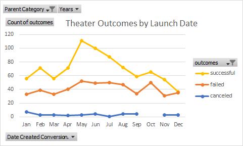
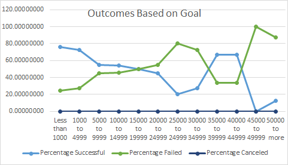

# Fundraising campaign Analysis
Performing analysis on past fundraising campaign data to uncover the trend
## Overview of Project and Purpose
Louise’s wants to launch a fundraising campaign and for that, she wants to know  how different campaigns performed in relation to their launch dates and their funding goals. We have a dataset that has data from different campaigns. I used this data to visualize campaign outcomes based on their launch dates and their funding goals. 
## Analysis and Challenges
To analyze the data, firstly, I cleaned the data by using various Excel functions. For example, I converted the date into correct and readable format. Then, I color-coded the outcomes and percentage funded. I used the pivot table and Vlookup function to create more crisp and useful data tables and then created the charts to have a clear view of the trends. 
### Analysis of Outcomes Based on Launch Date

### Analysis of Outcomes Based on Goals

 ### Challenges and Difficulties Encountered
It's very difficult to understand that much data in the starting as it is my first project. But, I did it step by step, and I am able to clean and make it readable. Another challenge I faced is that It took a lot of time as I am new to this. However, doing this Project, I learned a lot and now I can create a Pivot table, use filters in effective ways, and do Vlookup. 
## Results
### What are two conclusions you can draw about the Outcomes based on Launch Date?
1- The most successful events launched in the months of May, June, and July. Therefore, these months are ideal for launching an event.
2- December is the worst month to launch an event because the probability of success is the least in this month. 
### What can you conclude about the Outcomes based on Goals?
1-The probability of success decreases as the Goal amount increases and vice versa. The Goal amount should be less than $15000 to have the probability of success more than failure.
### What are some limitations of this dataset?
The data do  not have sufficient information about the common attributes of a successful and failed campaign. 
### What are some other possible tables and/or graphs that we could create?
 We can create a table and draw graphs about the outcomes based on the length of the events. 
